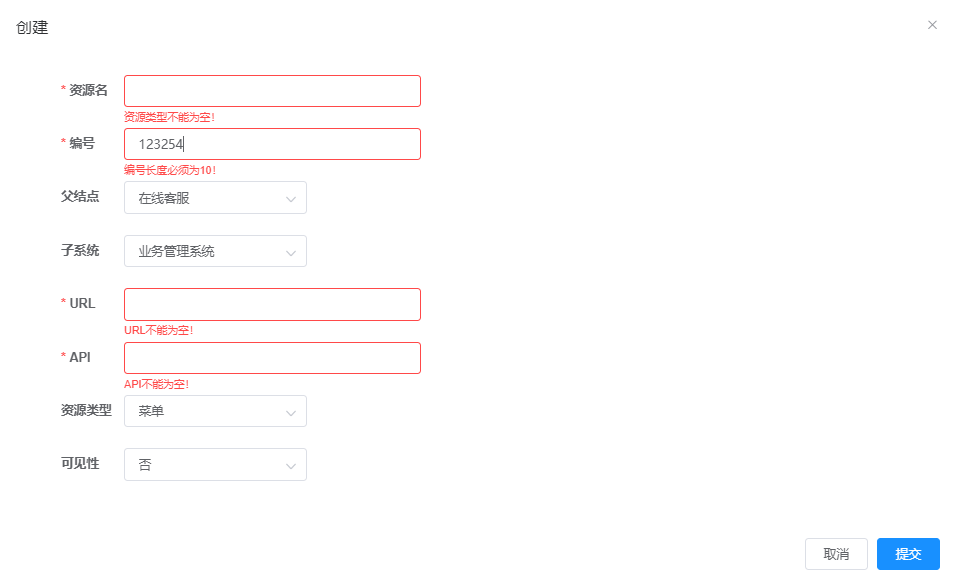

# 基于角色的管理系统

## 使用方法

- 项目克隆到本地
- npm run dev

## 主要包含的页面

- 登录页面

- 资源管理页面

- 角色管理页面

- 子系统管理页面

## 包含的操作页面

### 资源管理

- 添加资源

  

- 编辑资源

  

### 用户管理

- 添加用户

  

- 编辑用户

  

### 角色管理

- 添加角色

  

- 编辑角色

  

### 子系统管理

- 添加子系统

  

- 编辑子系统

  

  
